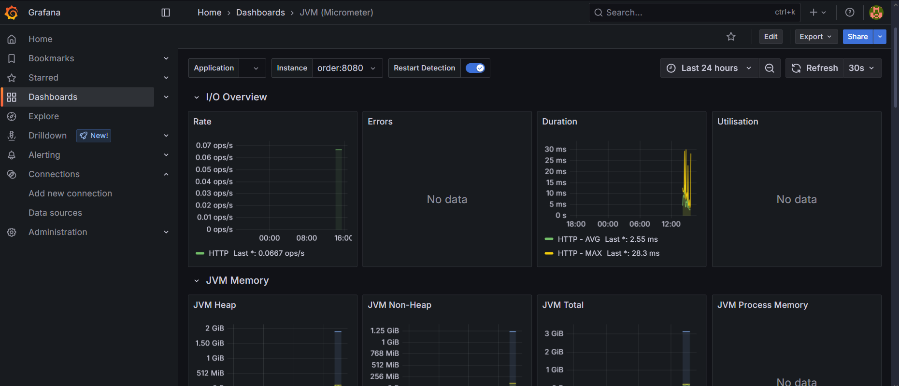

# Caching e Observabilidade

## Caching (Redis)

In-memory databases são uma excelente forma de melhorar a performance da aplicação. Elas armazenam dados frequentemente acessados na memória RAM, evitando consultas repetidas ao banco de dados relacional ou chamadas externas.

### Por que usar?

- **Redução de latência**: respostas mais rápidas ao evitar recomputações ou chamadas externas.
- **Desacoplamento**: separa o armazenamento temporário da lógica principal.
- **Escalabilidade**: alivia a carga do banco de dados relacional.

### Tecnologias utilizadas

- **Redis**: banco de dados in-memory amplamente utilizado.
- Pode ser acessado diretamente via cliente Redis em Python (ex: `redis-py`).

### Exemplo de uso

- Chave: `exchange:USD:EUR`
- Valor: JSON com os dados de conversão (`buy`, `sell`, `timestamp`)
- TTL: 5 minutos (ou outro valor adequado ao seu caso de uso)

### Benefícios adicionais

- Possibilidade de invalidar cache manualmente
- Cache distribuído entre múltiplas instâncias
- Monitoramento de acertos e falhas de cache (cache hit/miss)

---

## Observability (Prometheus + Grafana)

Observabilidade é a capacidade de compreender o estado interno de um sistema com base em suas saídas externas. É essencial para diagnóstico de problemas e manutenção da confiabilidade.

### Objetivos

- Monitorar tempo de resposta da API
- Detectar erros e falhas em tempo real
- Acompanhar uso de recursos (CPU, memória, tráfego)

### Ferramentas adotadas

- **Prometheus**: coleta e armazena métricas.
- **Grafana**: visualiza essas métricas em dashboards interativos.

### Métricas expostas

- `http_requests_total`: total de requisições por rota
- `http_request_duration_seconds`: tempo médio de resposta
- `http_cache_hits_total`: acertos no cache
- `http_cache_misses_total`: falhas de cache
- `python_gc_objects_collected_total`: objetos coletados pelo garbage collector

